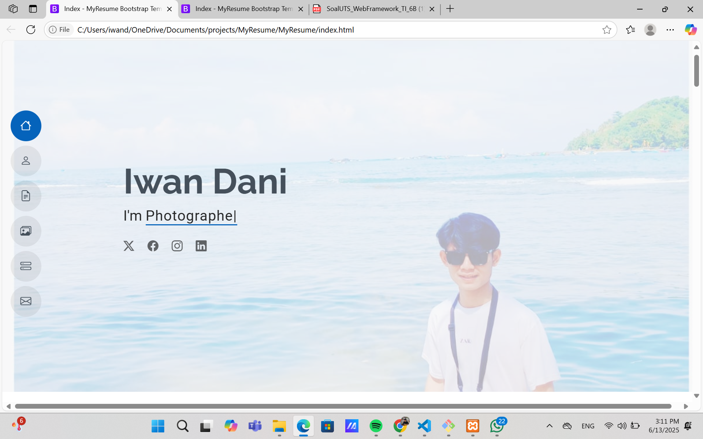
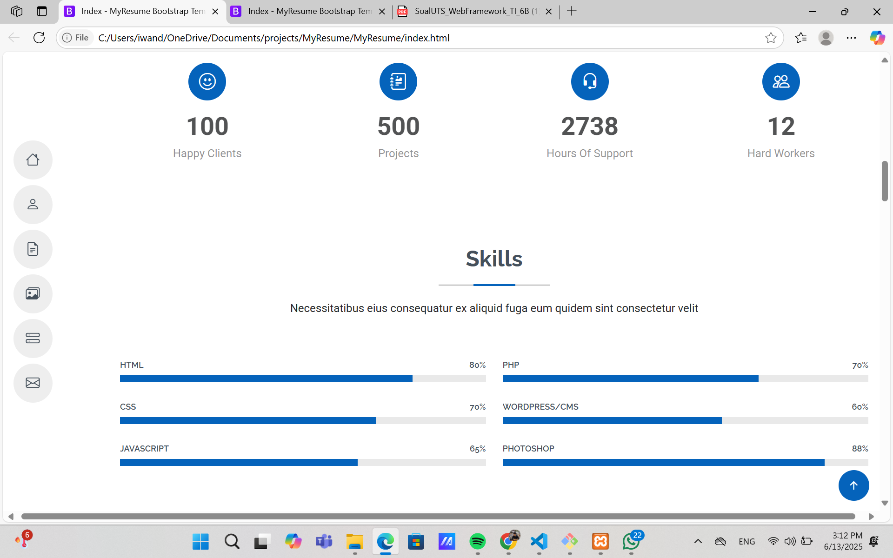
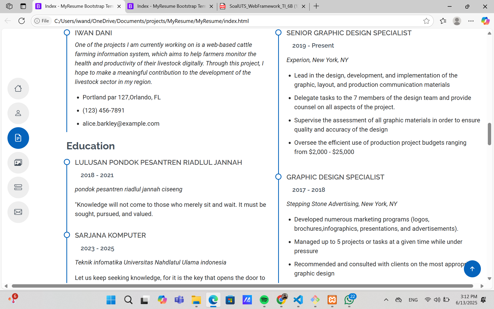
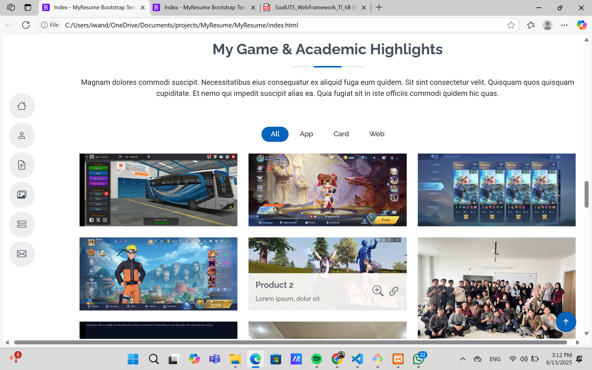

# Web Portofolio Pribadi - Project2

Mahasiswa mengerjakan Project Aplikasi berbasis Web secara statis menggunakan Bahasa 
Pemrograman PHP 8.x dengan Framework CodeIgniter 4. Poin-poin penilaian sebegai berikut: 
1. Source code pengerjaan project       
(70 poin) - - - 
Buatlah website portofolio sesuai dengan template MyResume (download) 
a) Persiapkan atau instalasi framework CI4;  
b) manfaatkan assets yang ada di template dan letakkan di public;  
c) lakukan konfigurasi, atur Home pada app/Controllers, dan siapkan v_home  
pada app/Views dengan kode dari index.html (template). 
Konten portofolio tentang diri Anda. 
2. Repository GitHub         - - 
Buatlah repository dengan nama project2 pada GitHub

## 🧑 Tentang Saya

**Nama:** Iwan Dani  
**NIM:** [22260016]  
**Program Studi:** [Teknik Informatika]  
**Universitas:** Universitas Nahdlatul Ulama Indonesia (UNUSIA)

## 🖼️ Screenshot Hasil

Berikut tampilan utama aplikasi:

- Tampilan Web Utama:  
  

- Tampilan Tentang Saya:  
  

- Tampilan Skill:  
  

- Tampilan Riwayat Hidup:  
  

- Tampilan Riwayat Pendidikan:  
  
